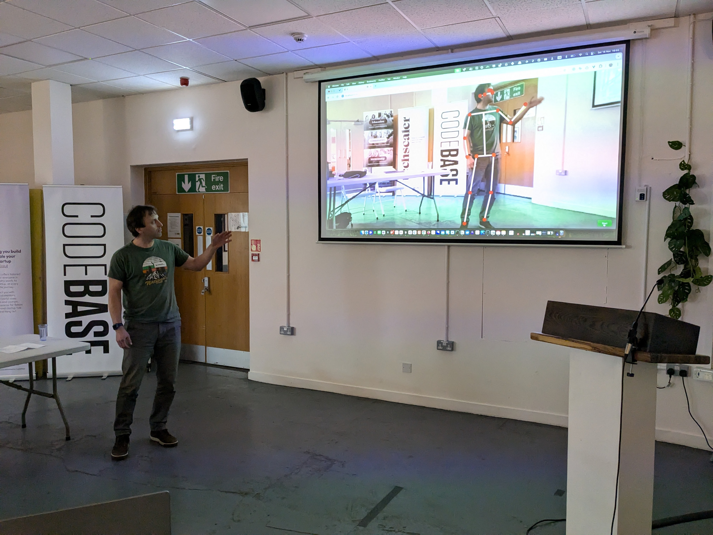

# KVA Web

Just a proof of concept to see if I can get the pose detection model to work in the browser. It is certainly not without bugs, but it was fun to work on! 🙂


Tools used:

- [Tensorflow.js](https://www.tensorflow.org/js)
- [Pose Detection](https://github.com/tensorflow/tfjs-models/tree/master/pose-detection)
- [React](https://react.dev/)
- [Vite](https://vitejs.dev/)

## Setup

```bash
pnpm install
```

## Run

```bash
pnpm dev
```

## How it works

Open up the app, allow the camera capture then show your whole self in the camera. The tensorflow algorith I am using here is [Pose Detection](https://github.com/tensorflow/tfjs-models/tree/master/pose-detection). It should pick you up and mark important parts of your body, like:

- Left and right ear
- Left and right eye
- Left and right shoulder
- Left and right elbow
- Left and right wrist
- Left and right hip
- Left and right knee
- Left and right ankle

## Screenshots





